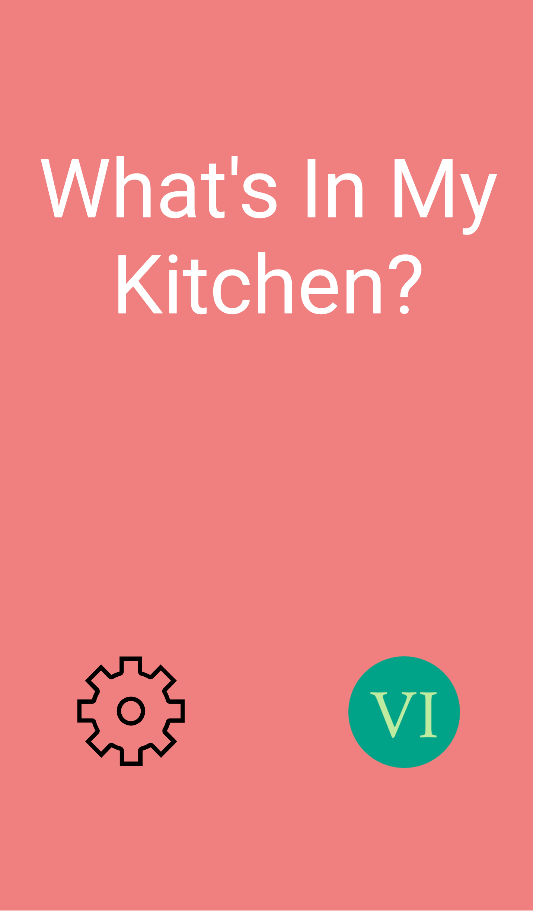
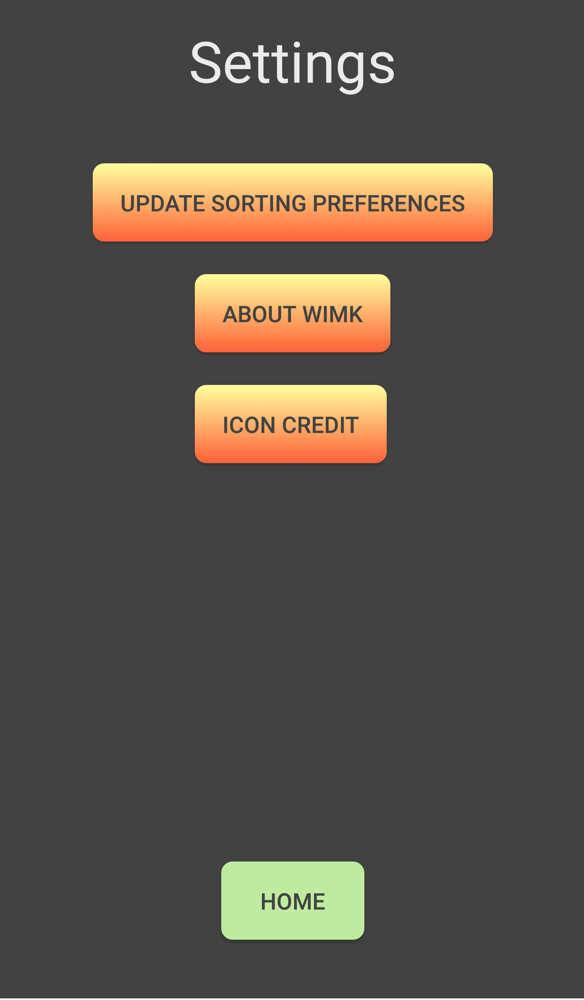
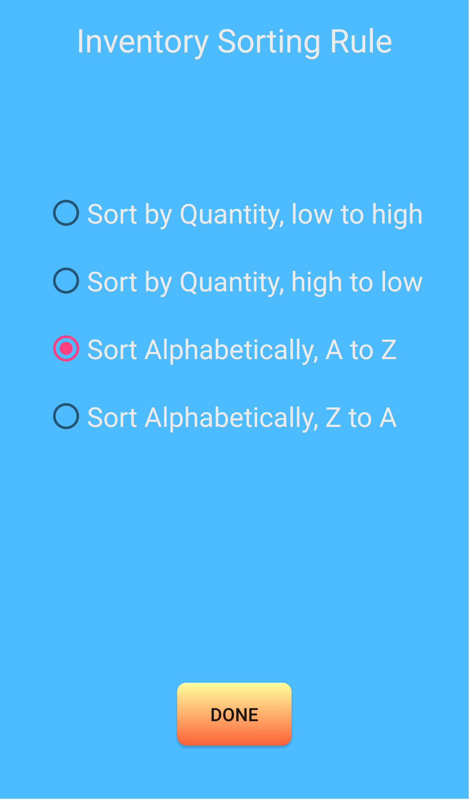
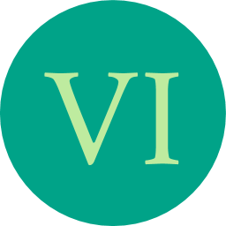
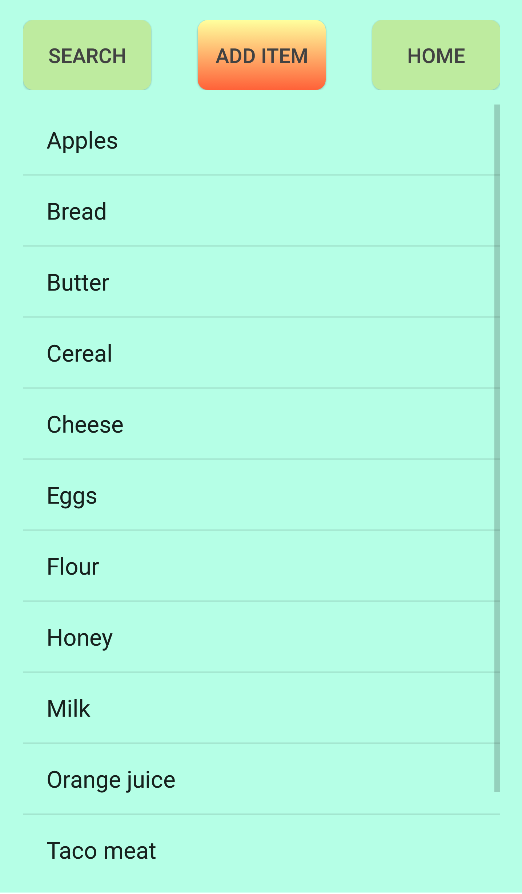
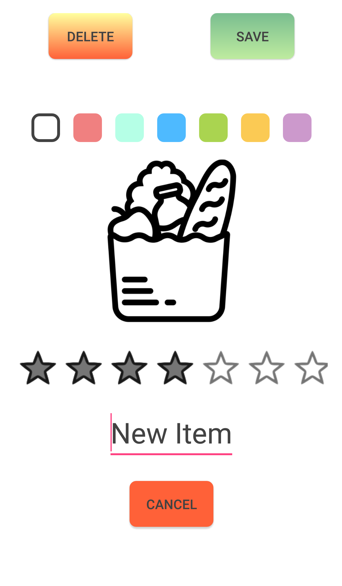

# Welcome to the **What's In My Kitchen?** mobile application!

---

## A brief introduction to **WIMK**:

### Main Menu

	This is the screen you will see upon opening the app

To keep things simple, there are just two options: **Settings** and **Visual Inventory**

---

### Settings

Clicking on the  **Settings** gear will take you to the **Settings** screen:

---

### Changing the Sorting Rule

Clicking **Update Sorting Rule** will take you here:

When you have decided how you would like your inventory to be sorted, simply click **Done**. The next time you open your inventory, everything will be sorted according to your choice!

---

### Viewing your Inventory

From the **Main Menu Screen**, click the  **Visual Inventory** button to open your inventory

Your inventory will looks something like this once you add a few items to it

---

### Adding to your Inventory

From the inventory screen, click the  **Add Item** to add a new item to your inventory

You will see this screen:

Here, you can choose a name and color for your new item, and drag to set the quantity.

In **WIMK**, quantity is relative to you. Set the quantity based on how much you typically keep around, and you'll never have to guess!

---

### Updating your inventory

You can update the name, color, and name of any item in your inventory simply by clicking on it in the inventory screen. This is also how you delete items that you no longer want to keep track of.

---

## Get out of the kitchen!

We designed **WIMK** to help you avoid buying groceries you already have or forgetting those you don't. That being said, the application is useful for keeping track of anything, not just food! Try using it to maintain tabs on things you don't buy often, like salt for your sidewalk, grease for your bike chain, or cleaning supplies.

---

# That's all, have fun!

---

Icon credit: [The Noun Project](https://thenounproject.com/) | Settings by Hysen Drogu | Groceries by Oliviu Stoian